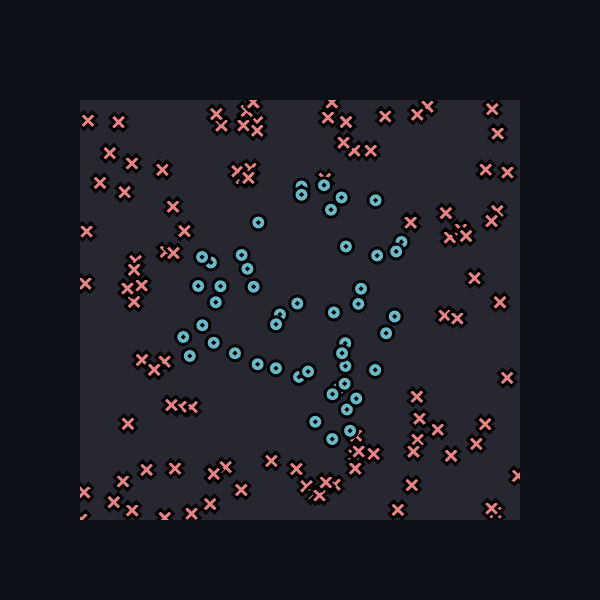
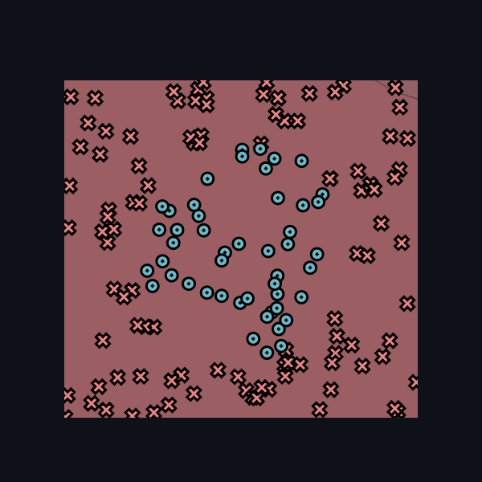
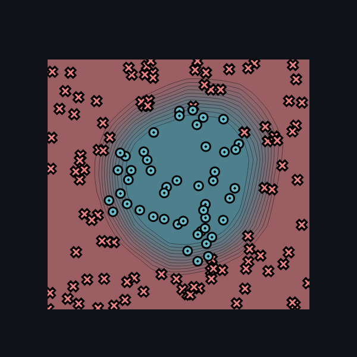
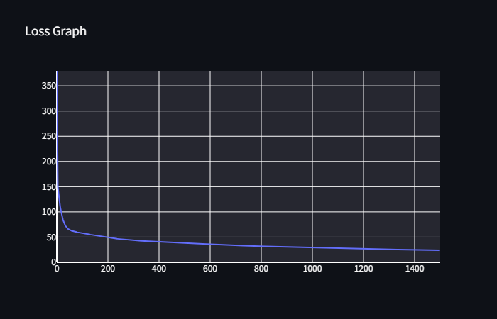
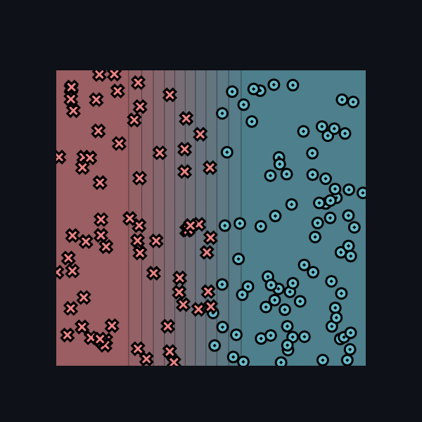

# Task 0.5: Visualization

## Train with PyTorch

###  Hyperparameters

* Learning rate: 1.0
* Number of epochs: 1500
* Size of hidden layer: 64

### Images

## Manual

### Parameters

* Weight_0_0: -6.48
* Weight_1_0: -0.0
* Bias:        2.53

### Images

